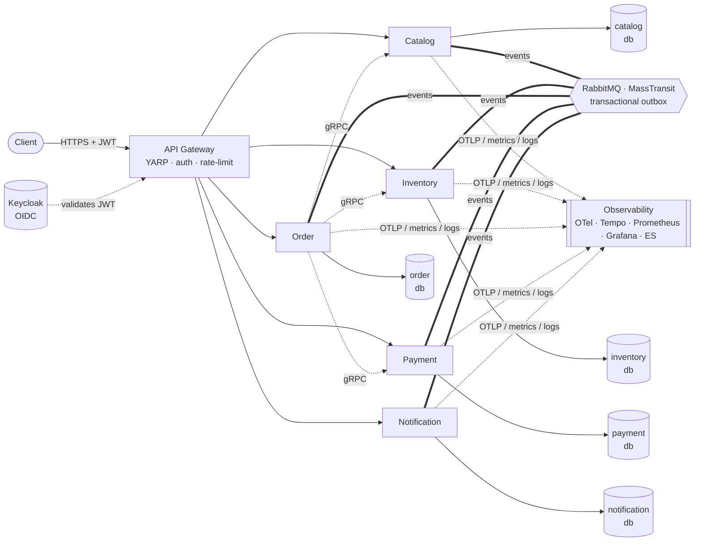
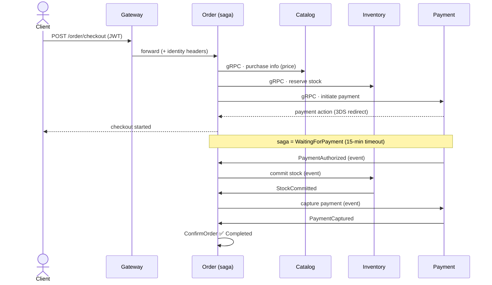
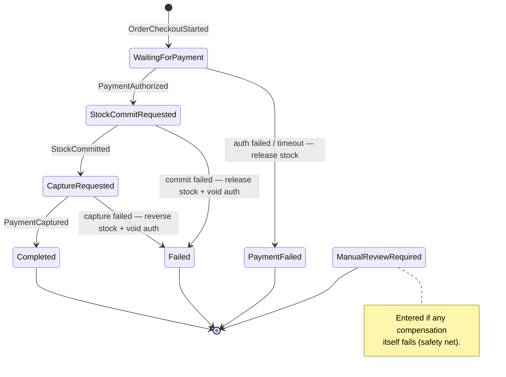

<div align="center">

# 🛒 Marketplace Order Platform

**A production-shaped .NET 8 microservices reference** — Clean Architecture, CQRS, an event-driven **checkout saga** with compensations, an **API gateway**, **Keycloak** auth, and full **observability**.


</div>

> ⚠️ **Sample project.** Every credential here (`postgres`, `admin`, `guest`, `Password123!`) is a local-development default — never use them in production.

---

## ✨ What it demonstrates

- **Microservices** — 5 independently deployable services, each owning its own database (no shared tables).
- **Clean Architecture + CQRS** — `Domain → Application → Persistence/Infrastructure → API`, with MediatR and FluentValidation.
- **Distributed transaction via saga** — checkout is orchestrated by a **MassTransit state machine** with explicit **compensations** and a payment **timeout** (the centerpiece, below).
- **Service-to-service communication** — synchronous **gRPC** for request/response, asynchronous **integration events** over RabbitMQ with the **transactional outbox** pattern.
- **API Gateway** — a single [YARP](https://microsoft.github.io/reverse-proxy/) entry point with rate limiting, JWT validation, role-based authorization, and identity propagation (incl. anti-spoofing of client headers).
- **Authentication** — **Keycloak** (OpenID Connect) issues JWTs; the gateway validates them and forwards the authenticated identity downstream.
- **Observability** — OpenTelemetry traces → Tempo, Prometheus metrics, Serilog logs → Elasticsearch, all visualized in **Grafana** with pre-provisioned dashboards.
- **Kubernetes** — kustomize manifests for the whole platform.

---

## 🏛️ Architecture



Each service is internally layered with a strict inward dependency direction (`Domain` depends on nothing). Engineering conventions live in [`AGENTS.md`](AGENTS.md).

---

## 🔄 The checkout saga (the centerpiece)

Order is the **orchestrator**. It first gathers data synchronously over gRPC, then drives a long-running **state machine** purely through events. Each step has a **compensation**, and if a compensation itself fails the saga parks the order in `ManualReviewRequired` for a human.

### Happy path



### State machine (happy path + compensations)



The full machine has **14 states** and handles **duplicate / out-of-order events** idempotently. See [`OrderCheckoutStateMachine.cs`](src/Services/Order/Order.Infrastructure/Messaging/Sagas/OrderCheckoutStateMachine.cs).

---

## 🧰 Tech stack

| Concern | Technology |
|---|---|
| Runtime | .NET 8, ASP.NET Core |
| Application | MediatR (CQRS), FluentValidation |
| Persistence | EF Core (Code-First), PostgreSQL 16 |
| Messaging | MassTransit + RabbitMQ (transactional outbox) |
| Sync RPC | gRPC |
| API Gateway | YARP Reverse Proxy |
| AuthN/Z | Keycloak 25 (OpenID Connect / JWT) |
| Observability | OpenTelemetry, Tempo, Prometheus, Serilog, Elasticsearch, Grafana |
| Orchestration | Docker Compose · Kubernetes (kustomize) |
| Testing | xUnit, MassTransit test harness (193 tests) |

---

## 🚀 Getting started

**Prerequisites:** Docker + Docker Compose (and the .NET 8 SDK to build/test outside containers).

```bash
docker compose up --build
```

This starts all services, the gateway, Keycloak, the databases, RabbitMQ, and the observability stack.

| Component | URL | Notes |
|---|---|---|
| **API Gateway** | http://localhost:8085 | single entry point |
| Catalog / Inventory / Notification / Payment / Order | :8080–:8084 | individual APIs |
| Keycloak | http://localhost:8086 | `admin` / `admin` |
| Grafana | http://localhost:3000 | `admin` / `admin` |
| Prometheus | http://localhost:9090 | metrics |
| RabbitMQ | http://localhost:15672 | `guest` / `guest` |

Drive a full checkout (exercises the saga end-to-end):

```bash
./scripts/smoke-checkout.sh
```

Build & test locally:

```bash
dotnet build MarketplaceOrderPlatform.sln
dotnet test  MarketplaceOrderPlatform.sln
```

---

## 📈 Observability

Pre-provisioned **Grafana dashboards** ship with the stack — open http://localhost:3000 → **Dashboards → Marketplace**:

| Dashboard | Shows |
|---|---|
| **Platform Overview (RED)** | request rate, 5xx ratio, p95 latency, scrape health per service |
| **Business & Saga Metrics** | inventory reservation lifecycle (reserve → commit → release → reverse), notifications, catalog writes |
| **Distributed Traces (Tempo)** | recent traces — click a `traceId` for the full cross-service span tree |

Run `./scripts/smoke-checkout.sh`, then watch the dashboards populate and follow a trace across Order → Inventory → Payment.

---

## ☸️ Kubernetes

Kustomize manifests for the entire platform (services, gateway, 5 PostgreSQL StatefulSets, RabbitMQ, Keycloak — 43 resources) live in [`k8s/`](k8s/).

```bash
kubectl kustomize k8s/ --load-restrictor LoadRestrictionsNone   # render / validate
kubectl apply     -k k8s/ --load-restrictor LoadRestrictionsNone # deploy
```

See [`k8s/README.md`](k8s/README.md) for prerequisites and the deploy walkthrough.

---

## 🗂️ Project structure

```
src/
  ApiGateways/Marketplace.ApiGateway/      # YARP gateway + Keycloak auth
  Services/<Catalog|Inventory|Notification|Order|Payment>/
      <svc>.{Domain,Application,Persistence,Infrastructure,API}
tests/Services/...                         # 17 test projects (unit + saga harness)
k8s/                                       # Kubernetes manifests (kustomize)
docker/                                    # Keycloak realm + observability config
scripts/                                   # migrations, smoke tests, local checks
```

---

## 📄 License

Released under the [MIT License](LICENSE).
